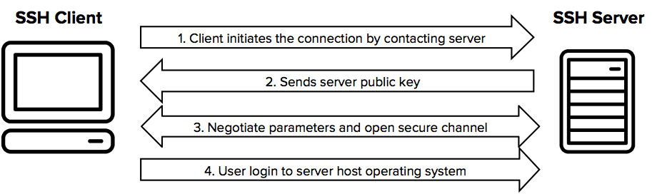

# Configuração SSH

## O que é o SSH?
O protocolo Secure Shell(SSH) é um protocolo seguro de comunicação para enviar e receber dados, estabelecendo uma comunicação em uam rede não segura entre cliente e servidor, servidor e servidor. Para isto o SSH criptograga a conexão entre as duas partes do processo de comunicação atráves da utilização de chaves públicas e provadas.<a href="[src/README.md](https://www.ssh.com/academy/ssh)"> Saiba Mais...</a>




### Por que usar SSH?
O SSH é um protocolo amplamente utilizado nos processos de comunicação, com destaque as plataformas de versionamento como GitLab e GitHub que utilizam o protocolo para estabelecer uma comunicação com maquinas locais, tornando possível a integração entre a plataforma e o computador, facilitando de forma segura o trafégo de dados em comandos utilizados pelo Git, como `git clone`, `git push` e `git pull` por exemplo. 


---

## 1. Criando chave
O primeiro passo no processo de utilização do SSH no Git é verificar se existe uma chave, caso não exista, crie uma chave para sua máquina local:

### Verificando:
```bash
ls -al ~/.ssh
```
caso a listagem não retorne arquivos iniciando com `id_`, como o tradicional `id_ed25519`(chave privada) e o `id_ed25519.pub`(chave pública), execute o passo abaixo: 

### Criando:
```bash
ssh-keygen -t ed25519 -C "seu-email@exemplo.com"
```

### Atribuindo chave ao agente SSH:
```bash
eval "$(ssh-agent -s)"
ssh-add ~/.ssh/id_ed25519
```

## 2. Cópia da chave pública

### Verificando existencia das chaves:
```bash
ls -al ~/.ssh
```
caso a listagem não retorne arquivos iniciando com `id_`, como o tradicional `id_ed25519`(chave privada) e o `id_ed25519.pub`(chave pública), execute o passo abaixo:

#### Mostrar chave no terminal
```bash
cat ~/.ssh/id_ed25519.pub
```

O passo acima tem como objetivo copiar a chave pública. Após copiar a chave SSH pública, basta acessar a plataforma Web, GitHub ou GitLab, de sua preferência, encontrar a área de configuração SSH e colar sua chave pública. Verifique o processo nesses tópicos:

<li><a href="docs/03-Conexão GitLab.md"> Conexão GitLab</a></li>
<li><a href="docs/04-Conexão GitHub.md"> Conexão GitHub</a></li>

